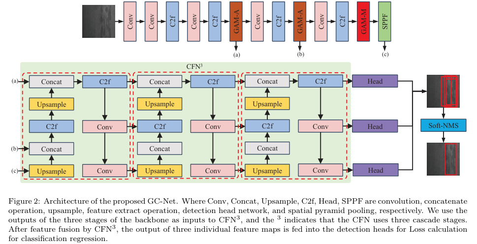
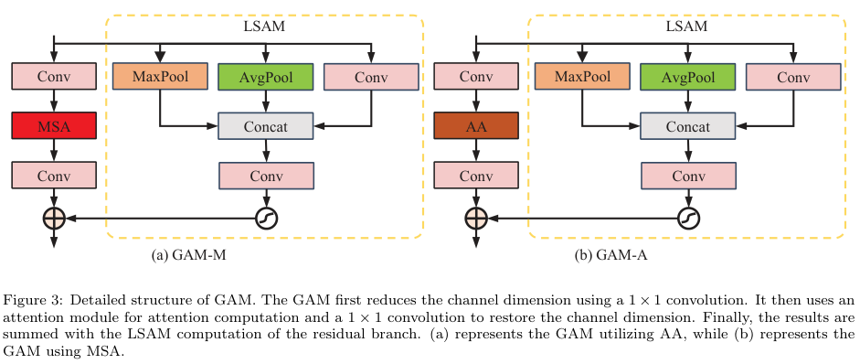
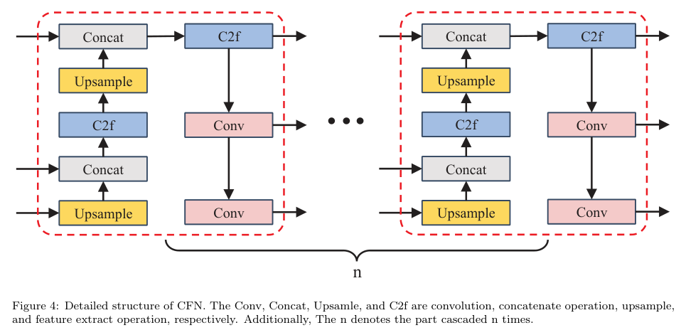

# GC-Net
GC-Net: Global Attention Module and Cascade Fusion Network for Steel Surface Defect Detection









## Citation
If our work is helpful to you, you can cite it.

```
@article{gcnet,
title = {Global attention module and cascade fusion network for steel surface defect detection},
journal = {Pattern Recognition},
volume = {158},
pages = {110979},
year = {2025},
issn = {0031-3203},
doi = {https://doi.org/10.1016/j.patcog.2024.110979},
url = {https://www.sciencedirect.com/science/article/pii/S0031320324007301},
author = {Guanghu Liu and Maoxiang Chu and Rongfen Gong and Zehao Zheng},
}
```